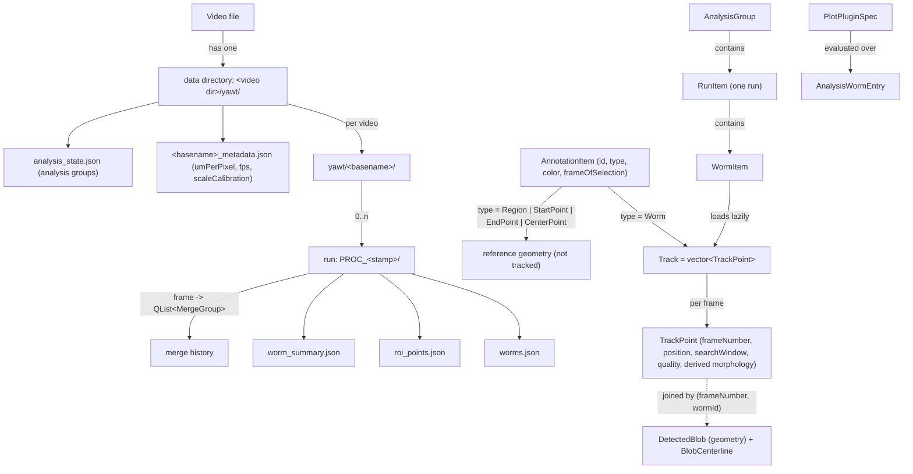

# YAWT Ontology

The vocabulary of the codebase as it stands on the `ONTOLOGY` branch. This is the
reference to keep names consistent against; `ONTOLOGY_REVIEW.md` is the record of the
problems it replaced and why each change was made. `docs/centerline_pipeline.md`
defines the centerline pass's internal code names (Phase A/B/C, Sweep, Step, D-1..D-4).

Rule of thumb for new code: if a concept below has a name, use that name and no
synonym. If a concept is missing, add it here in the same commit that introduces it.

---

## 1. The pipeline in one paragraph

A **video** is thresholded into per-frame **blobs**. On a **keyframe** the user marks
**annotations**: **worms** to track, **regions**, and **reference points**. A
**tracker** per worm and direction produces a **track** of **track points** across the
video, recording per frame the blob it anchored on, the **search window** it scanned, and
a **quality** label. Trackers that share a blob form a **merge group**. A post-pass
computes each blob's **centerline** and assigns **head** and **tail** tips, guided by a
**topology** classification and per-worm **tip-feature baselines**. Everything is written
to a **run** folder. The **analysis** tab groups runs into **analysis groups** and
evaluates **plugins** over track points.

## 2. Layers and where they live

| Layer | Directory | Nouns |
|---|---|---|
| Capture | `src/gui/widgets/capture*`, `*camerasource*` | camera source, live view |
| Video | `src/gui/widgets/videoloader.*`, `frameloader.*` | video, frame, frame cache, threshold settings, crop |
| Annotation | `src/data/trackingcommon.h` (`TableItems`), `src/models/annotationtablemodel.*` | annotation item, item type, keyframe |
| Detection | `src/data/trackingcommon.*`, `src/utils/thresholdingutils.*` | blob, contour, hole contour |
| Tracking | `src/core/wormtracker.*`, `trackingmanager.*` | tracker, tracker state, track, track point, quality, search window, shared blob, merge group, split resolution |
| Centerline | `src/core/centerline*` | skeleton graph, tip, tip candidate, topology, baseline, predictor, snake |
| Storage | `src/data/trackingdatastorage.*`, `videometadatastore.*` | items, tracks, blob store, merge history, tip baselines, scale |
| Persistence | `src/data/wormsjsoncodec.*`, `TrackingManager::save*` | data directory, run, the files in §7 |
| Analysis | `src/data/analysistypes.h`, `src/gui/analysis*`, `src/plugins/*` | analysis group, run item, worm entry, plugin spec, aggregate, binding, reduce, plot |
| Debug | `src/debug/*` | frame debug record, endpoint debug, centerline branch |

Dependency direction: `utils` ← `data` ← `core` ← `gui`; `plugins` depends on `data`
only, plus `gui` for the one widget that subscribes to the session model; `debug`
depends on `core` types, and `core` refers to `debug` only through a forward
declaration and an optional sink.

## 3. Entity graph

## 4. Canonical glossary

| Term | Definition | Name in code |
|---|---|---|
| **Video** | A source file. Owns one data directory. | `videoPath`, `videoBaseName` |
| **Data directory** | `<video dir>/yawt/`. Holds per-video folders, metadata, and analysis state. | `dataDir`, `dataDirectory` |
| **Video directory** | `yawt/<basename>/`. Holds that video's runs. | `videoDirectory` |
| **Run** | One tracking execution: `yawt/<basename>/PROC_<yyyy-MM-dd-HHmmss>/`. | `runDir`, `runStamp`, `RunItem`, `m_runDirectory` |
| **Frame** | Absolute frame index in the source video. The only frame index outside the tracker. | `frameNumber` |
| **Sequence index** | Index into a tracker's forward-or-reversed working frame vector. Tracker-internal. | `sequenceIndex`, `m_sequenceIndex` |
| **Keyframe** | The frame a worm was marked on; tracking runs outward from it. A property of each worm; all worms tracked in one run must share it. | `AnnotationItem::frameOfSelection`, `keyFrame` (the shared value of a run) |
| **Annotation item** | A user mark on the video: a worm, a region, or a reference point. | `TableItems::AnnotationItem`, `itemId` |
| **Item type** | What an annotation is. | `ItemType::{Worm, Region, StartPoint, EndPoint, CenterPoint, Undefined}` |
| **Worm** | An annotation of type Worm; the unit of tracking and analysis. Its id is the key of every track-level API. | `wormId` |
| **Region** | A user-drawn rectangle annotation. Not tracked. | `ItemType::Region` (file string "Region"; legacy "ROI" is read) |
| **Reference point** | A Start, End, or Center point annotation used by plugins. | `ReferencePoints`, `hasStartPoint`, `startPoint`, ... |
| **Search window** | The fixed-size box a tracker scans on each frame. | `searchWindow`, `initialSearchWindow`, `touchesSearchWindow` |
| **Blob** | A connected component on one thresholded frame. Detection-time geometry. | `Tracking::DetectedBlob` |
| **Blob centerline** | The centerline pass's results for one blob. Empty until the pass runs; serialised separately. | `Tracking::BlobCenterline`, `DetectedBlob::centerline` |
| **Shared blob** | A per-frame blob that several trackers reference. In-memory only. | `SharedBlob` |
| **Track** | One worm's points in ascending frame order. | `Tracking::Track` |
| **Track point** | One worm on one frame. | `Tracking::TrackPoint` |
| **Quality** | Persisted per-point label. See §5. | `Tracking::TrackPointQuality` |
| **Tracker state** | Live belief of a running tracker. See §5. | `Tracking::TrackerState` |
| **Topology** | Geometric class of a worm's blob. See §5. | `Tracking::TopologyState`, `BlobCenterline::topology` |
| **Merge group** | The worm ids sharing one blob on one frame. | `Tracking::MergeGroup`; history is frame → `QList<MergeGroup>` |
| **Centerline** | Ordered polyline from head to tail. | `BlobCenterline::points`; UI: `ViewModeOption::Centerlines` |
| **Centerline midpoint** | The middle sample of the ordered centerline; used as the alternative to the blob centroid for the displayed animal trace. Analysis plugin `x`/`y` still use the track point's centroid position. | `BlobCenterline::points[points.size() / 2]`, `CenterlineState::midpoint()` |
| **Skeleton** | The Zhang-Suen raster and its graph, used to find the centerline. | `Centerline::SkeletonGraph` |
| **Tip** | A body end. **Head** and **tail** are roles assigned to tips. | `TrueTip`, `TipCandidate`, `headTip`, `tailTip`, `headTipIdx`, `tailTipIdx` |
| **Skeleton endpoint** | A degree-1 node of the skeleton; the usual source of a tip. Distinct from a tip. | `detectEndpoints`, `EndpointResult` |
| **Tip-feature baseline** | Per-worm running statistics of tip curvature, tip width, and body length. | `Centerline::TipFeatureBaseline` |
| **Motion-based head/tail refinement** | The post-sweep pass that flips head/tail where motion contradicts the recorded head. | `refineHeadTailByMotion`, `headTailMotionSwapEvent` |
| **Tracking direction** | Forward or backward in time from the keyframe. Encoded in the sign of the tracker id. | `WormTracker::TrackingDirection` |
| **Facing** | Whether a worm's motion agrees with its recorded head. | `WormFacing` / `FacingTimeline` (module not on this branch; rename when the timeline work lands) |
| **Scale** | Micrometres per pixel. The only scale representation in code. | `umPerPixel` |
| **Analysis group** | A user grouping of runs for plotting. | `AnalysisGroup`, `analysis_state.json` |
| **Worm entry** | One worm's data as the plots see it. | `AnalysisWormEntry`, `AnalysisGroupData` |
| **Plugin** | A YAML metric and plot specification. | `PlotPluginSpec` |

## 5. The three state vocabularies

| Enum | Values | Owner | Persisted |
|---|---|---|---|
| `TrackerState` | Idle, TrackingSingle, TrackingMerged, PausedForSplit, TrackingLost | `WormTracker` (live) | no |
| `TrackPointQuality` | Single = 0, Merged = 1, Split = 2, Lost = 3 | `TrackPoint` | yes: `worms.json` `quality`; plugin constants |
| `TopologyState` | Unknown, Clean, SelfCrossed, Merged, Lost | `BlobCenterline` | yes: `centerline.topology` |

`Tracking::qualityForFrame(state, hasValidBlob, splitResolvedThisFrame)` is the single
mapping from the first to the second. The integer values of `TrackPointQuality` are a
public plugin contract and must never be reordered. `TopologyState` is derived later by
the centerline pass and does not feed back into quality.

`PausedForSplit` is live: the tracker stops advancing and TrackingManager resolves the
split synchronously, then queues `resumeTrackingWithAssignedTarget()`.

## 6. Coordinate frames

Defined once at the top of `src/data/trackingcommon.h`:

| Frame | Meaning | Where used |
|---|---|---|
| **video** | Pixels of the source frame, origin top-left. Every stored position. The only frame persisted. | everywhere |
| **local** | Pixels relative to a blob's padded bounding box. | skeleton and distance-transform buffers inside `detectEndpoints` |
| **widget** | Pixels of a Qt widget. Transient. | `VideoLoader`, `MiniLoader` |
| **crop** | Pixels of MiniLoader's cropped image. Transient. | `MiniLoader` |

## 7. Identity

| Thing | Key | Scope |
|---|---|---|
| Annotation item / worm | `int id` from `TrackingDataStorage::m_nextId`; `itemId` in item APIs, `wormId` in track APIs | one run |
| Tracker instance | signed worm id: `+id` forward, `-id` backward (`conceptualWormId` names the unsigned id where the contrast matters) | one run, in memory |
| Shared blob | `SharedBlob::uniqueId` | one run, in memory |
| Run | folder name `PROC_<stamp>` (`runStamp`) | one video |
| Analysis worm | (`runDir`, `wormId`); `AnalysisSessionModel::checkRevision()` is the cache key because `wormId` alone is per-run | project |

## 8. Persisted files

All reading and writing of `worms.json` and `roi_points.json` goes through
`WormsJson` (`src/data/wormsjsoncodec.h`), which documents the schema.

| File | Location | Content |
|---|---|---|
| `worms.json` | run | header, metrics, worm items, tracks with per-point `blob` and `centerline`, `mergeGroupsByFrame`, `tipBaselines`, `mergeState` (compressed) |
| `roi_points.json` | run | header + Region / Start / End / Center items |
| `worm_summary.json` | run | per-worm scalar summary (snake_case keys) |
| `thresholding.json`, `input_blobs.json` | run | the run's threshold settings and initial worms |
| `<basename>_tracks.xlsx`, `<basename>_headtail_swaps.xlsx`, `<basename>_ProcessingSummary.txt` | run | exports |
| `<basename>_metadata.json` | data directory | `umPerPixel`, `fps`, `scaleCalibration` |
| `analysis_state.json` | data directory | analysis groups → runs → `checkedWormIds` |

Keys that keep an older word for file compatibility, and what they mean now:

| Key | Reads as | Written? |
|---|---|---|
| point `roi` | search window | yes |
| blob `touchesROIboundary` | `touchesSearchWindow` | yes |
| item type `"ROI"` | `ItemType::Region` | no (writes "Region") |
| item type `"Fix"`, `"Control Point"` | Worm, CenterPoint | no |
| point `detectedBlob`, point `centerlinePoints` | pre-split blob layouts | no (writes `blob` + `centerline`) |
| `input_blobs.json` `initialRoi` | initial search window | yes |
| `mergeState.nextPhysicalBlobId`, `wormToPhysicalBlobIdMap` | shared-blob counters | yes |
| metadata `pixelSizeUm` | legacy pixels per µm, inverted on read | no (writes `umPerPixel`) |
| `analysis_state.json` `procStamp` | `runStamp` | yes |

## 9. Words still carrying two meanings

Deliberately left, with the reason.

- **ROI** survives in the drawing tool (`InteractionMode::DrawROI`, `roiDefined`,
  `handleRoiDefined`), the reference-items table widget (`roiTableView`), the
  standardised-window sizing (`roiSizeMultiplier`, `getCurrentFixedRoiSize`), and
  `findPlausibleBlobsInRoi`. These are UI object names and a user-facing setting; renaming
  them is a `.ui` change with no ontology payoff.
- **Blob** in `EditBlobs`, `blobClickedForAddition`, `onViewBlobsToggled` is correct: those
  act on detected blobs.
- **`keyFrameNum` / `videoKeyFrameNum`** in TrackingManager and WormTracker are the run's
  shared keyframe; `keyFrame` would be tidier but they are internal.
- **`TableItems`** is the namespace of `AnnotationItem` and `ItemType`; a rename to
  `Annotations` is cosmetic.
- **`lcModelsBlobTable`** logging category still names the old model.
- **`WormDirection` / `WormDirectionTimeline`** exist only in the worm-direction-timeline
  worktree and should become `WormFacing` / `FacingTimeline` when merged.
