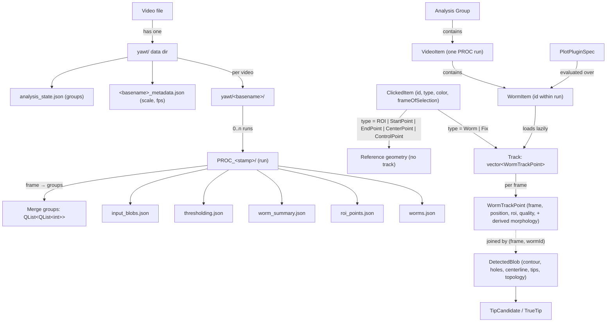

# YAWT Ontology Review

**Reviewed revision:** branch `claude/worm-direction-timeline-17e744` at `451cb5e` ("Populate blob-derived track fields in memory, not just on save").
This is the most recent branch in the repository. It is one commit ahead of `head_tail` and `main` (both at `541fcc5`), so everything below also applies to `head_tail` except where the head/tail refresh and the `WormDirection` module are mentioned.
The worktree for that branch (`.claude/worktrees/nifty-wilbur-34d86b`) also carries uncommitted work: a new `src/core/wormdirection.cpp`, CMake entries for it, and MainWindow wiring for the direction timeline. Those files were included in the review.

**Scope.** An ontology review asks: what are the things this program talks about, what are they called, how do they relate, and is that vocabulary consistent across code, UI, on-disk files, and docs? It is not a bug review. Where a naming problem also hides a behavioural risk, that is noted.

**Method.** Read every header under `src/`, the plugin reference, the bundled plugin YAMLs, the JSON serialisers in `TrackingManager` and `TrackingDataStorage`, and the git history. Grepped for every use of the overloaded terms discussed below.

---

## 1. Summary

The codebase has a clear and mostly sound conceptual core: a **video** is thresholded into per-frame **blobs**; the user marks **items** on a **keyframe**; per-item **trackers** run forward and backward to produce **tracks** of **track points**; a post-pass extracts a **centerline** with **head** and **tail** tips per blob; **analysis** groups worms across **runs** and evaluates **plugins** over track points.

The problems are almost all vocabulary drift accumulated over the project's phases, not conceptual confusion. The most consequential:

1. **"Blob", "ROI", "Item/Worm", "Direction", "Merged" and "Lost" each mean three to six different things** depending on file. Several of these collide inside a single class (`TrackingDataStorage`, `VideoLoader`).
2. **Three overlapping state vocabularies describe one worm on one frame**: `TrackerState` (tracker confidence), `TrackPointQuality` (persisted per-point label), and `TopologyState` (blob geometry). Their mapping is implicit and lossy.
3. **Track history is held in four places** during a run: `WormObject`, `TrackingManager::m_finalTracks`, `TrackingDataStorage::m_tracks`, and the per-frame blob store. `TrackingDataStorage` documents itself as the "single source of truth" but is the last to be written.
4. **Spatial scale is expressed four ways**: `umPerPixel`, `pixelsPerUm`, `pixelsPerUnit` (arbitrary unit), and a legacy JSON key `pixelSizeUm` that holds pixels/µm and is inverted on load. The `VideoMetadataStore` header documents a `scale` section and a written `pixelSizeUm` field, neither of which matches the code. The UI inverts µm/pixel to pixels/µm at the controller boundary with a comment acknowledging the mismatch.
5. **Doc comments describe enum values and mechanisms that no longer exist** (`TrackingNormally`, `TrackingAsMerged`, "no longer using pause mechanism" next to 13 live uses of `PausedForSplit`, a `TrackedItem` type that was renamed `ClickedItem`).
6. **Internal phase code names leak into public type documentation** ("Phase A/B/C.2", "D-1 … D-4") with no glossary in the repository explaining them.
7. **Layering inversion**: the plugin engine (`src/plugins`) depends on a GUI model class (`src/gui/analysissessionmodel.h`) for its input type.

Section 6 gives a prioritised fix list and a proposed canonical glossary.

---

## 2. The ontology as implemented

### 2.1 Layers

| Layer | Directory | Core nouns |
|---|---|---|
| Capture | `src/gui/widgets/capture*`, `*camerasource*` | Camera source, live view, recording |
| Video | `src/gui/widgets/videoloader.*`, `frameloader.*` | Video, frame, frame cache, threshold settings, crop |
| Annotation (pre-tracking) | `src/data/trackingcommon.h` (`TableItems`), `src/models/blobtablemodel.*` | Item (`ClickedItem`), item type, keyframe (`frameOfSelection`) |
| Detection | `src/data/trackingcommon.*`, `src/utils/thresholdingutils.*` | Detected blob, contour, hole contour, area, aspect ratio |
| Tracking | `src/core/wormtracker.*`, `trackingmanager.*`, `wormobject.*` | Tracker, tracker state, track, track point, quality, search ROI, physical blob, merge group, split resolution |
| Centerline / head-tail | `src/core/centerline*`, `src/core/wormdirection.*` | Skeleton graph, true tip, tip candidate, topology state, baseline, predictor, snake, facing |
| Storage | `src/data/trackingdatastorage.*`, `videometadatastore.*` | Item, track, blob store, merge history, tip baseline, scale calibration |
| Persistence | `TrackingManager::save*Json`, `AnalysisSessionModel::saveState` | `yawt/` data dir, `PROC_*` run, `worms.json`, `roi_points.json`, `worm_summary.json`, `thresholding.json`, `input_blobs.json`, `<video>_metadata.json`, `analysis_state.json`, `*_tracks.xlsx`, `*_headtail_swaps.xlsx` |
| Analysis | `src/gui/analysis*`, `src/plugins/*` | Group, video (run), worm entry, plugin spec, aggregate, binding, reduce, plot |
| Debug | `src/debug/*` | Pipeline, centerline branch, frame debug record |

### 2.2 Core entity graph

### 2.3 Identity

| Thing | Key | Scope | Notes |
|---|---|---|---|
| Item / worm | `int id` from `TrackingDataStorage::m_nextId` | One run | The same integer is called `itemId`, `wormId`, `trackId`, `fixBlobId`, `conceptualWormId` in different APIs. |
| Tracker instance | signed worm id: `+id` forward, `-id` backward | One run | `TrackingManager::getSignedWormId`. Sign encodes `TrackingDirection`. Not persisted. |
| Physical blob | `FrameSpecificPhysicalBlob::uniqueId` | One run, in memory | Never persisted; merge groups are persisted as lists of worm ids instead. |
| Run | `PROC_yyyy-MM-dd-HHmmss` folder name | One video | `procStamp` in analysis state. |
| Analysis worm | (`procDir`, `wormId`) | Project | `AnalysisSessionModel` comments correctly warn that `wormId` alone is not unique across runs, and uses `checkRevision` as the cache key. `PluginEngine::WormScalar` and `WormSeries` carry only `wormId` + `label`. |
| Frame | `int` absolute frame index in the source video | Video | See §4.5 for the naming spread. |

---

## 3. Overloaded terms

Each row is one word that names several distinct concepts. The severity column reflects how likely a reader is to be misled.

### 3.1 "Blob"

| Usage | Meaning | Where |
|---|---|---|
| `DetectedBlob` | A connected component on one thresholded frame, with geometry. | `trackingcommon.h:226` |
| "blob" in `BlobTableModel`, `addBlobFromVideo`, `deleteBlobById`, `removeAllBlobs`, "Fix blob" | A user-created **item** (`ClickedItem`), which may be a Worm, ROI, or reference point, not a blob at all. | `appcontroller.h:79-82`, `blobtablemodel.h` |
| `FrameSpecificPhysicalBlob` | A per-frame merged entity shared by several trackers. | `trackingmanager.h:96` |
| "blob store" / `m_detectedBlobsByFrame` | The map frame → wormId → `DetectedBlob`. | `trackingdatastorage.h:514` |
| `input_blobs.json` | The initial worm list plus threshold settings. | `trackingmanager.h:316` |
| `ViewModeOption::Blobs` | Overlay of items/blobs on the video. | `videoloader.h:118` |

Severity: high. `TrackingDataStorage::addItem` is documented as "Add a new item (blob)". The `roiTableView` shows items that the API calls blobs but are points.

### 3.2 "ROI"

| Usage | Meaning |
|---|---|
| `ItemType::ROI` | A user-drawn rectangle item that is *not* tracked. Created by `MainWindow::handleRoiDefined`, whose own doc says "Adds the ROI as a worm candidate" (it does not; it adds type `ROI`). |
| `WormTrackPoint::roi`, `WormTracker::m_currentSearchRoi`, `searchRoiUsed` | The fixed-size **search window** the tracker used on that frame. |
| `InitialWormInfo::initialRoi`, `ClickedItem::initialBoundingBox` ("THIS WILL BECOME THE STANDARDIZED ROI") | The standardised search window derived from global metrics × `roiSizeMultiplier`. |
| `ClickedItem::originalClickedBoundingBox` | The actual blob bounding box at click time. |
| `VideoLoader` "general purpose ROI" (`m_activeRoiRect`, `roiDefined`, `InteractionMode::DrawROI`) | A transient rectangle drawn on the canvas, reused for crop. |
| `roi_points.json`, `PluginRoiPoints`, "ROI reference points" | Start / End / Center **points** (and ROI-type items). |
| `roiTableView`, `m_roiProxyModel` | The table of all non-worm items. |
| `touchesROIboundary` | Blob touches the search window edge. |

Severity: high. The phrase "ROI reference points" in `plugin_reference.md` refers to things that are not regions. `roi_points.json` contains both regions and points.

### 3.3 "Item" vs "Worm" vs "Track"

`TrackingDataStorage` uses `itemId` for item APIs and `wormId` for track APIs on the same key space (`getItem(itemId)` vs `getWormDataForFrame(wormId)`; `setTrackForItem(itemId)` vs `getLostTrackingSegments(wormId)`). `VideoLoader` calls the same key `trackId`. `TrackingManager::startRetrackingProcess` calls it `fixBlobId`. The tracker docs say "conceptual worm ID" to distinguish it from the signed tracker id, but that adjective is not used consistently.

A `ClickedItem` of type `StartPoint` is still an "item" with an `id` drawn from the same counter as worms, so a worm and a reference point can never share an id even though nothing depends on that.

### 3.4 "Direction"

| Usage | Meaning |
|---|---|
| `WormTracker::TrackingDirection` {Forward, Backward} | Direction in **time** from the keyframe. Encoded in the sign of the tracker id. |
| `WormDirection::Facing` {Forward, Reverse, Unassigned} | Whether the worm's **motion** agrees with its recorded head. |
| `headTailDirectionSwapEvent`, `m_dirHeadTailSwapData`, "direction-based pass" | A head/tail flip decided from **motion direction** in the centerline worker. |
| `CenterlineFrameDebug::directionStep` | Step of the forward/backward sweep in the centerline pass. |
| `WormDirectionTimeline` | UI widget for `Facing`. |

Severity: high on the new branch. The namespace `WormDirection` and the tracker enum `TrackingDirection` use the word `Forward` for unrelated things. `Facing` is the better term and already exists; the namespace and widget should follow it.

### 3.5 "Merged"

Five representations of "this worm shares a blob with another on this frame":

1. `TrackerState::TrackingMerged` (live tracker belief).
2. `TrackPointQuality::Merged` (persisted per point; also assigned when state is `PausedForSplit`, see `trackingmanager.cpp:1170`).
3. `TopologyState::Merged` (set by the centerline pass when `inMergeGroup`).
4. `m_mergeHistory` / `mergeGroupsByFrame` (frame → groups of worm ids), the persisted ground truth.
5. `FrameSpecificPhysicalBlob::participatingWormTrackerIDs` (in-memory during run).

Plus `frames_merged` in the summary, `MergeSpan` in `WormTimeline`, and `MergeViewer`. `TrackingManager::m_frameMergeRecords` is documented as "the authoritative per-frame view" while `TrackingDataStorage` documents itself as "single source of truth" for the same data.

### 3.6 "Lost"

`TrackerState::TrackingLost`, `TrackPointQuality::Lost`, `TopologyState::Lost`, `AnnotationTableModel::AnnotationType::Lost`, `getLostTrackingSegments`, `getLostTrackingFrames`, `frames_lost`. These are consistent in meaning, but a lost track point is persisted with `position = (0, 0)` as a "placeholder (won't be used for display)". A reader of `worms.json` has no way to know that `(0,0)` is a sentinel except by reading `quality`. The plugin engine correctly filters on `quality != Lost`, but nothing enforces that.

### 3.7 "Centerline" vs "Skeleton"

`DetectedBlob::centerlinePoints` is the ordered polyline. `SkeletonGraph::skeleton` is the Zhang-Suen raster. `VideoLoader::ViewModeOption::Skeletons` and `MiniLoader::setShowSkeleton` display the **centerline**. `MainWindow::onViewSkeletonsToggled` toggles the centerline overlay. `TrackDisplayMode::CenterlineMidpoint` uses the right word. Recommend "centerline" everywhere user-facing and "skeleton" only for the raster/graph.

### 3.8 "Position", "Centroid", "Center"

`WormTrackPoint::position` is the blob centroid. `DetectedBlob::centroid` is the same thing. `ItemType::CenterPoint` is a user reference point unrelated to either. `HeadTailPredictor::lastCenterPos` is the centerline midpoint. `MiniLoader::centerPoint` is the crop centre. The plugin vocabulary calls the track position `x, y` and the reference point `center_x, center_y`, which is fine, but the C++ names do not distinguish the three centres.

### 3.9 "Tip", "Endpoint", "Nose", "Head"

`TipCandidate`, `TrueTip`, `skeleton endpoint`, `EndpointResult`, `detectEndpoints()`, "nose/tail", "head/tail". The docs use "nose" and "head" interchangeably for the same end. `TipCandidate::Source::SkeletonEndpoint` names a tip by its provenance; `TrueTip` names it by confidence. `EndpointResult` bundles tips, topology *and* head/tail assignment, so its name undersells it.

---

## 4. Parallel and redundant representations

### 4.1 Three state enums for one worm-frame

| Enum | Values | Owner | Persisted |
|---|---|---|---|
| `Tracking::TrackerState` | Idle, TrackingSingle, TrackingMerged, PausedForSplit, TrackingLost | `WormTracker` | No |
| `Tracking::TrackPointQuality` | Single, Merged, Split, Lost | `WormTrackPoint` | Yes (`worms.json` `quality`, and as plugin constants 0..3) |
| `Tracking::TopologyState` | Unknown, Clean, SelfCrossed, Merged, Lost | `DetectedBlob` | Yes (`detectedBlob.topologyState`) |

The mapping from the first to the second is `Single if TrackingSingle else Merged`, so `PausedForSplit` and `TrackingLost`-with-a-valid-blob both collapse to `Merged`. `Split` is set only on the frame where a split resolution happened and is documented as "functionally like Single for display". `TopologyState::Merged` is set from the merge-group store, not from `TrackPointQuality`, so the two can disagree on a frame.

The plugin reference exposes `quality` as integers with named constants `Single=0 … Lost=3`. This freezes the enum order as a public contract; reordering `TrackPointQuality` would silently change every plugin. Nothing in the header says so.

### 4.2 Four homes for the track

During a run, the same `WormTrackPoint`s live in:

1. `WormObject::m_trackHistoryMap` + `m_trackHistoryVector` (two containers inside one object).
2. `TrackingManager::m_finalTracks` (`AllWormTracks`), rebuilt from the `WormObject`s.
3. `TrackingDataStorage::m_tracks` + `m_frameIndex`, populated at the end.
4. The blob store `m_detectedBlobsByFrame`, from which `refreshDerivedTrackData()` now joins morphology back into the track points (the head commit).

`WormObject` has most of its API commented out and exists only to sort points by frame from two trackers. It is the only class in `src/data` that `TrackingDataStorage` does not know about. `trackingmanager.h:32` documents it as "track history ownership", which contradicts `trackingdatastorage.h:19`.

### 4.3 Morphology duplicated on the point and the blob

`WormTrackPoint` now carries `area`, `aspectRatio`, `bodyLength`, `headTip`, `tailTip`, `hasTips`. `DetectedBlob` carries `area`, `boundingBox`, `centerlinePoints`, `tipCandidates`, `assignedHeadTipIdx`, `assignedTailTipIdx`. The point fields are a denormalised cache of the blob fields. That is a reasonable choice for the analysis path, but:

- `worms.json` writes both (`tips`, `area`, `aspectRatio` on the point **and** the full `detectedBlob`), so the file has two copies that can disagree after a partial rerun.
- `refreshDerivedTrackData()` documents the sync rule; nothing else does. A grep for `headTip` finds writers in three files.

### 4.4 Spatial scale

| Name | Meaning | Where |
|---|---|---|
| `umPerPixel` | µm per pixel | Metadata store, analysis model, plugin engine, MainWindow (dominant, 50+ uses) |
| `pixelsPerUm`, `setPixelSizePixelsPerUm`, `m_pixelSizePixelsPerUm` | pixels per µm | `AppController`, `TrackingManager` |
| `ScaleCalibration::pixelsPerUnit` + `unit` | pixels per arbitrary unit ("mm") | `VideoMetadataStore`, `CapturePanel`, `ScaleDialog` |
| JSON key `umPerPixel` | µm per pixel; the canonical persisted value | `<basename>_metadata.json` top level |
| JSON key `pixelSizeUm` (legacy, read-only) | **pixels per µm**; inverted by `loadUmPerPixel()` when `umPerPixel` is absent. The header wrongly says `saveScale` writes it. | `<basename>_metadata.json` top level |
| `um_per_pixel` | µm per pixel | `worm_summary.json` |

`mainwindow.cpp:564` reads: "Spinbox now shows µm/pixel; AppController still takes pixels/µm — invert at boundary." The manager then inverts it back at `trackingmanager.cpp:2089`. One representation should be canonical end to end. µm/pixel already is in practice.

### 4.5 Frame numbering

Ten spellings for "which frame": `frameNumber` (269 uses), `frameNumberOriginal` (84), `currentFrame`, `originalFrameNumber` (30), `m_currFrameNum` (tracker-local sequence index, **not** the original frame), `keyFrame`, `frameOfSelection` (17), `sequenceFrameIndex` (14), `keyFrameNum`, `videoKeyFrameNum`.

Two genuinely different concepts are being named: the absolute frame index in the video, and the index into a tracker's forward-or-reversed working sequence. Only `WormTracker` needs the second. Everything else should use one name for the first. `frameOfSelection` on `ClickedItem` is the keyframe and is validated to be identical across all worms (`validateAndGetSharedKeyframe`), so it is a run property masquerading as a per-item field.

### 4.6 Coordinate frames

The comments use "video coordinates" (57 uses), "image coordinates" (12), "world coords" (7, only in `centerlinetypes.h`), "local coords" / "mask-local" (5, skeleton buffers), "widget coords" (12), plus MiniLoader's "mini" and "crop" coordinates. "Video", "image" and "world" are the same frame. The centerline module introduced "world" without a definition anywhere; `SkeletonGraph` explains local vs world in its own comment, which is good but isolated.

---

## 5. Stale, misleading, or misplaced vocabulary

### 5.1 Doc comments that describe things that do not exist

| Location | Says | Reality |
|---|---|---|
| `wormtracker.h:12-15` | States are `TrackingNormally`, `TrackingAsMerged`, `PausedForSplit`, `Lost` | Enum is `Idle`, `TrackingSingle`, `TrackingMerged`, `PausedForSplit`, `TrackingLost` (`trackingcommon.h:151`) |
| `trackingmanager.h:77`, `:111` | "No longer using paused worm resolution", "No longer using pause mechanism - split resolution is immediate" | `PausedForSplit` has 13 live uses in `.cpp` files; `resumeTrackingWithAssignedTarget` is a live slot; `attemptImmediateSplitResolution` coexists with it |
| `trackingcommon.h:390` | `} // namespace TrackingHelper` | Closes `namespace Tracking` |
| `blobtablemodel.h:10`, `:69`, `:76`, `videoloader.h:36`, `:226` | `TrackedItem` | Type is `ClickedItem`; `TrackedItem` exists nowhere |
| `trackingcommon.h:27` | `TableItems` "used within the BlobTableModel, for user interaction with blobs prior to tracking" | `ClickedItem` is the persisted item record for the whole run and outlives tracking |
| `trackingdatastorage.h:441-450` and `videoloader.h:248-250` | Long notes explaining that `itemColorChanged` was removed | Historical, not descriptive; belongs in git history |
| `wormobject.h:1`, `:2` | `// WormObject.h`, include guard `WORMWOBJECT_H` | Typo in guard; file is `wormobject.h` |
| `trackingmanager.h:154` | `startRetrackingProcess(... fixBlobId ...)` | No caller anywhere outside its own definition; the "Fix" item type and retracking flow are dead from the UI |
| `mainwindow.h:173` | `handleRoiDefined`: "Adds the ROI as a worm candidate" | Adds `ItemType::ROI`, which is never tracked |
| `plotpluginspec.h:57` | Filter example `"quality == 1"  (1 = Single)` | Single is 0; Merged is 1 (`pluginloader.h:34` and `plugin_reference.md` agree on 0) |
| `videometadatastore.h:12-27` | Documents a `scale` section as the only content, and says `saveScale` writes a `pixelSizeUm` field | Code writes `scaleCalibration`, `umPerPixel`, and `fps`; `pixelSizeUm` is a legacy pixels/µm key that is only read |

### 5.2 Enum members with no behaviour

- `ItemType::ControlPoint`: appears in filter lists and the type delegate, but nothing reads its geometry. It is not in `PluginRoiPoints`, not in `roi_points.json` loading semantics beyond round-trip, and has no meaning documented anywhere.
- `ItemType::Fix`: colour override in storage, and it counts as trackable in `MainWindow` and `TrackingManager`, but the only feature that gave it meaning (`startRetrackingProcess`) is unreachable.
- `ItemType::Undefined`: one use, as the parse fallback.
- `AnnotationTableModel::AnnotationType`: only `Lost`; the "Future: Merge, Split" comment dates from before the timeline widget took over that role, and `annoTableView` binding is commented out in `MainWindow`.
- `TrackerState::Idle`: set in the constructor, never reached again.
- `PlotPluginSpec::Aggregate::Spatial`: parsed by `PluginLoader` and documented in `plugin_reference.md` as "binned 2D grid; used for heatmaps", but `PluginEngine::PluginResult` has no spatial output and no bundled plugin uses it. A user who writes `aggregate: spatial` gets a silently wrong plot.
- `PlotPluginSpec::PlotType::Scatter`: parsed, documented as "requires formula_x and formula_y; see extensions", but no `formula_x` field exists and `PluginPlotWidget` renders it with `paintLine` (`pluginplotwidget.cpp:256`). It is an alias for `line`.

### 5.3 Phase and branch code names

`Phase A`, `Phase B`, `Phase C`, `Phase C.1`, `Phase C.2`, `D-1`, `D-2`, `D-3`, `D-4`, `0-tip ring cut` appear in `trackingcommon.h`, `centerlinetypes.h`, `trackingdatastorage.h`, `debugrecords.h`, and `centerlineprocessor.cpp` (60+ occurrences). `Debug::CenterlineBranch` gives the D-branches human names, which is the right idea, but no document in the repository defines the phases. A new reader cannot tell whether "Phase C.2" is done, planned, or abandoned. Either add a short `docs/centerline_pipeline.md` that defines them, or rename the references to what they do ("tip-feature baseline", "endpoint detection", "topology classification").

### 5.4 Layering

- **`src/plugins` depends on `src/gui`.** `PluginEngine::evaluate` takes `QList<AnalysisSessionModel::AnalysisGroupData>`, and `pluginengine.h` includes `../gui/analysissessionmodel.h`. `AnalysisGroupData` / `AnalysisWormEntry` are plain data and belong in `src/data` or `src/plugins`; the model should produce them, not own their definition.
- **`namespace Tracking` in `trackingcommon.h` mixes** value types (`DetectedBlob`, `WormTrackPoint`), algorithms (`findClickedBlob`, `populateCenterlineFromContour*`, `extractOrderedCenterlinePoints`, `resampleCenterlinePoints`), a static helper (`sqDistance`, defined `static` in a header so every TU gets a copy), and enums. The centerline functions live in `Tracking` while their types live in `Centerline`.
- **`DetectedBlob` carries centerline-phase fields** (`centerlinePoints`, `centerlineCutPoint`, `tipCandidates`, `assignedHeadTipIdx`, `topologyState`) that are empty during tracking and filled by a later pass. The struct's name and doc ("information about a detected blob during tracking") no longer match its contents. Consider a `BlobGeometry` (detection-time) + `BlobCenterline` (post-pass) split, or at least a doc that states which fields belong to which phase.
- **`centerlinetypes.h` includes debug-only structs** (`TipCapDebug`, `EndpointCandidateDebug`) that `EndpointResult` carries by value on every call. `debugrecords.h` then includes `centerlinetypes.h` to get them back. The dependency runs the wrong way.
- **`TrackingDataStorage` is called "single source of truth"** but `TrackingManager` writes `worms.json` from its own `m_finalTracks` plus storage lookups, and `MainWindow::loadRunFromDirectory` re-reads the file into storage. Storage should be the only thing the serialiser reads, and the head commit moves in that direction.
- **`AnalysisSessionModel` does file I/O** (`scanYawtDirectory`, `loadTracksFromJson`, `saveState`, `loadRoiReferencePoints`), duplicating `TrackingDataStorage::loadFromWormsJson` with its own parser (`parseWormIds`, `loadTracksFromJson`). Two readers of `worms.json` will drift.

### 5.5 Persistence vocabulary

- **Key casing is mixed across files.** `worms.json`, `roi_points.json`, `<basename>_metadata.json` and `analysis_state.json` use camelCase (`frameOfSelection`, `mergeGroupsByFrame`, `pixelsPerUnit`). `worm_summary.json` uses snake_case (`frames_lost`, `mean_speed_um_per_s`, `um_per_pixel`). Plugin YAML uses snake_case (`y_label_um`, `per_worm`). Pick one for JSON; snake_case would match the plugin vocabulary users already write.
- **`roi_points.json` and `worms.json` both have a top-level `items` array** with identical item schema, split by type. A reader must know that worms are in one file and reference points in the other. The split is not explained in either file (`version: 1` in both, no `kind` field).
- **`worms.json` embeds `videoPath` as an absolute path** and `keyFrame`. Moving the project breaks the link, and nothing warns about it (`AnalysisSessionModel::buildWarnings` checks only scale and reference points).
- **`tipBaselines` are not persisted**, so a loaded run has empty baselines until a centerline rerun. `clearAllData()` mentions them; `loadFromWormsJson` cannot restore them.
- **`analysis_state.json`** stores `checkedWormIds` inside each `groups → videos → (baseName, procStamp)` entry, so the checked set is already keyed by run. (An earlier draft of this review said otherwise; that was wrong.) The remaining gap is only that a re-processed run resets the selection to all-checked, which is intentional.
- **`PROC_` is a prefix, not a concept name.** The code calls it "proc dir", "run", "processing output directory", "video-specific directory" (for the parent), and the UI calls it a run (`runDirectoryDoubleClicked`, `loadRunFromDirectory`). "Run" is the right noun and should appear in the type names (`VideoItem::procDir` → `runDir`).

### 5.6 Plugin vocabulary drift

The plugin vocabulary is the best-designed part of the ontology (§7), which makes drift there more costly because users write against it.

- **`prev_<binding>` is an undocumented vocabulary feature.** `PluginEngine` exposes every binding's previous-frame value as `prev_<name>` (`pluginengine.cpp:430`, `:494`, `:651`), and the shipped `plugins/head_tail_flip_timeline.yaml` depends on it (`prev_hx`, `prev_tx`, …). Neither `docs/plugin_reference.md` nor the schema block in `pluginloader.h` mentions it. It also overlaps `diff()`, which is documented, so a user cannot tell which is the intended primitive.
- **The built-in plugin table is stale.** `plugin_reference.md` lists ten plugins; `plugins/` ships eleven. `head_tail_flip_timeline.yaml` is missing from the table.
- **`quality` constants are exposed as integers whose values are the C++ enum order** (§4.1). The reference lists them as `Single = 0 … Lost = 3` without saying they are stable, and `plotpluginspec.h:57` gives the wrong value in its example.

---

## 6. Recommendations

Ordered by value per unit of churn. Items in the first block are safe renames or comment fixes with no behavioural change.

### 6.1 Do now (comment and doc fixes, no code change)

1. Fix the `wormtracker.h` state-machine block to name the real enum values.
2. Delete or correct the two "no longer using pause" comments in `trackingmanager.h`; decide whether `PausedForSplit` is live and document that decision.
3. Replace `TrackedItem` with `ClickedItem` in comments (`blobtablemodel.h`, `videoloader.h`), and fix the namespace closing comment in `trackingcommon.h:390`.
4. Fix the `quality == 1  (1 = Single)` example in `plotpluginspec.h`.
5. Document the `quality` integer contract on `TrackPointQuality` itself: "Order is a public plugin contract; append only."
6. Add a one-page `docs/centerline_pipeline.md` defining Phase A/B/C and D-1..D-4, or replace those references with descriptive names.
7. Update `videometadatastore.h` to document the keys the code actually writes (`umPerPixel`, `fps`, `scaleCalibration`) and mark `pixelSizeUm` as a legacy pixels/µm key that is read but never written.
8. Document `prev_<binding>` in `plugin_reference.md` and `pluginloader.h`, add `head_tail_flip_timeline.yaml` to the built-in table, and either implement `spatial` or remove it from the schema docs until it exists.

### 6.2 Do soon (mechanical renames, tooling-assisted)

9. **Unify the id name.** Pick `wormId` for the shared key and use it in `TrackingDataStorage`, `VideoLoader`, and `AppController`. Reserve `itemId` for nothing, or rename `ClickedItem` → `AnnotationItem` and use `itemId` only for non-worm items. Either is fine; the current mix is not.
10. **Rename the search window.** `WormTrackPoint::roi` → `searchWindow`; `InitialWormInfo::initialRoi` → `initialSearchWindow`; `touchesROIboundary` → `touchesSearchWindow`. This frees "ROI" for the user-drawn region item and the reference points.
11. **Rename the reference-point family.** `roi_points.json` → keep the file name for compatibility but rename the C++ side: `PluginRoiPoints` → `ReferencePoints`, "ROI reference points" → "reference points" in `plugin_reference.md`, `m_roiProxyModel` → `m_referenceItemsProxy`.
12. **Rename direction concepts on the new branch before they spread.** `namespace WormDirection` → `namespace Facing` (or `WormFacing`), `WormDirectionTimeline` → `FacingTimeline`, `headTailDirectionSwapEvent` → `headTailMotionSwapEvent`. Keep `TrackingDirection` for time.
13. **Rename "skeleton" UI toggles to "centerline"** (`ViewModeOption::Skeletons`, `setShowSkeleton`, `onViewSkeletonsToggled`, `skeletonButton`).
14. **Canonicalise scale to µm/pixel end to end.** `AppController::setPixelSizePixelsPerUm` → `setUmPerPixel`, drop the two inversions, rename `m_pixelSizePixelsPerUm`. Keep `ScaleCalibration::pixelsPerUnit` only inside the measure dialog and convert once on save.
15. **Canonicalise frame naming.** `frameNumber` for the absolute index everywhere except `WormTracker`, where `sequenceIndex` names the tracker-local index. Retire `frameNumberOriginal` / `originalFrameNumber` (they exist because the tracker once needed to disambiguate; nothing outside the tracker does).
16. Replace "image coordinates" and "world coords" with "video coordinates" in comments, and add a three-line definition of video / local / widget frames at the top of `trackingcommon.h`.
17. Move `AnalysisGroupData` / `AnalysisWormEntry` out of `AnalysisSessionModel` into `src/data/analysistypes.h` so `src/plugins` stops including `src/gui`.
18. Move the centerline free functions out of `namespace Tracking` into `namespace Centerline` (they already live in `centerlinegeometry.cpp` / `trackingcommon.cpp` split; the namespace should follow the file).

### 6.3 Do later (structural)

19. **Collapse the state enums.** Persist `TrackPointQuality` and `TopologyState` as they are, but derive quality from a single documented function of (`TrackerState`, `hasValidBlob`, `splitResolvedThisFrame`) and put that function next to the enum, not inline in `handleFrameUpdate`.
20. **Retire `WormObject`.** Have trackers write into a manager-owned `AllWormTracks` keyed by frame; `std::map<int, WormTrackPoint>` per worm already gives the sort order `WormObject` exists to provide.
21. **Decide the fate of `Fix` and retracking.** Either wire `startRetrackingProcess` to the UI or delete it together with `ItemType::Fix`, the red colour override, and the `Fix` branches in `MainWindow`, `BlobTableModel`, `ItemTypeDelegate`. Same for `ControlPoint`.
22. **Split `DetectedBlob`.** Detection-time geometry (`centroid`, `boundingBox`, `area`, `convexHullArea`, `contourPoints`, `holeContourPoints`, `isValid`, `touchesSearchWindow`) and centerline-pass results (`centerlinePoints`, `cutPoint`, `tipCandidates`, head/tail indices, `topologyState`). Serialise them as two JSON objects so a rerun of the centerline pass can replace one without touching the other.
23. **One reader for `worms.json`.** Make `AnalysisSessionModel::loadTracksFromJson` delegate to `TrackingDataStorage::loadFromWormsJson` (or a shared `WormsJsonCodec` in `src/utils`) so the analysis path cannot drift from the tracking path. The `TrackingManager::saveWormsJson` writer should live in the same codec.
24. **Persist tip baselines** in `worms.json` (they are three Welford triples per worm) so a loaded run is analysable without a rerun.
25. **Key analysis selection by run.** Already the case: `analysis_state.json` stores `checkedWormIds` inside each video entry (see §5.5). No change needed.
26. **Pull debug structs out of `centerlinetypes.h`.** `EndpointResult` should not carry `TipCapDebug` and `EndpointCandidateDebug` by value; give `detectEndpoints()` an optional `Debug::CenterlineFrameDebug*` sink instead.

### 6.4 Proposed canonical glossary

| Term | Definition | C++ name (proposed) | Replaces |
|---|---|---|---|
| **Video** | A source file; owns one data dir. | `Video` | — |
| **Data dir** | `<video dir>/yawt/`. | `dataDir` | "yawt directory", "data directory", "working directory" |
| **Run** | One tracking execution: `yawt/<basename>/PROC_<stamp>/`. | `runDir`, `RunItem` | "proc dir", "processing output directory", `VideoItem` |
| **Frame** | Absolute index into the video. | `frameNumber` | `frameNumberOriginal`, `originalFrameNumber` |
| **Sequence index** | Index into a tracker's working frame vector. | `sequenceIndex` | `m_currFrameNum`, `sequenceFrameIndex` |
| **Keyframe** | The frame where all worms were selected. | `keyFrame` (run property) | `frameOfSelection` (per item) |
| **Item** | A user annotation on the keyframe. | `AnnotationItem` | `ClickedItem`, "blob" |
| **Worm** | An item of type Worm; the unit of tracking and analysis. | `wormId` | `itemId`, `trackId`, `fixBlobId` |
| **Reference point** | Start / End / Center point item. | `ReferencePoint(s)` | "ROI reference point", `PluginRoiPoints` |
| **Region** | A user-drawn rectangle item. | `ItemType::Region` | `ItemType::ROI` |
| **Search window** | The fixed-size box a tracker scans. | `searchWindow` | `roi`, `initialRoi`, `searchRoiUsed` |
| **Blob** | A connected component on one thresholded frame. | `DetectedBlob` | (keep; stop using for items) |
| **Physical blob** | A per-frame entity shared by several trackers. | `SharedBlob` | `FrameSpecificPhysicalBlob` |
| **Track** | Ordered track points for one worm. | `Track` | `std::vector<WormTrackPoint>` |
| **Track point** | One worm on one frame. | `TrackPoint` | `WormTrackPoint` |
| **Quality** | Persisted per-point label. Order is a plugin contract. | `TrackPointQuality` | — |
| **Tracker state** | Live belief of a running tracker. | `TrackerState` | — |
| **Topology** | Geometric class of a worm's blob. | `TopologyState` | — |
| **Merge group** | Set of worm ids sharing a blob on a frame. | `MergeGroup` | `QList<int>` |
| **Centerline** | Ordered polyline from head to tail. | `centerline` | "skeleton" in UI |
| **Skeleton** | Raster medial axis / graph used to find the centerline. | `SkeletonGraph` | — |
| **Tip** | A body end. **Head** and **tail** are roles assigned to tips. | `Tip`, `headTip`, `tailTip` | "nose", "endpoint" |
| **Facing** | Whether motion agrees with the recorded head. | `Facing` | `WormDirection` |
| **Tracking direction** | Forward or backward in time from the keyframe. | `TrackingDirection` | — |
| **Scale** | µm per pixel. | `umPerPixel` | `pixelsPerUm`, `pixelSizeUm`, `pixelsPerUnit` |
| **Group** | Analysis grouping of runs. | `AnalysisGroup` | `GroupItem` |
| **Plugin** | YAML metric + plot spec. | `PlotPluginSpec` | — |

---

## 7. Appendix: what is in good shape

Worth saying, because the fix list above is long.

- The `Centerline` namespace headers (`centerlinetypes.h`) have the best documentation in the codebase: every struct states its coordinate frame, its producer, and its consumer.
- `TrackingDataStorage`'s header block (responsibilities, invariants, concurrency, signal semantics) is a model for the other stores.
- `AnalysisSessionModel` correctly identifies and documents the per-run id problem and designs around it with `checkRevision`.
- The plugin vocabulary (`plugin_reference.md`) is coherent, unit-aware (`_px` / `_um` suffixes, auto-select), and matches `pluginloader.h`. It is the one place where the ontology was designed rather than accreted, and it should be the reference the C++ names converge on.
- The head commit's `refreshDerivedTrackData()` states its sync rule in the header. That is the right pattern for every derived field.
